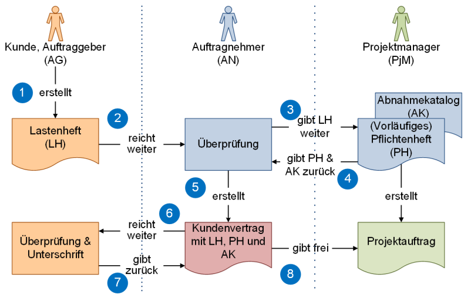
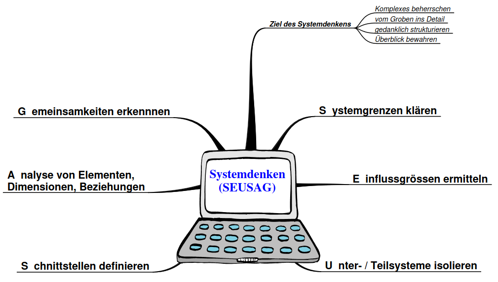

# Projektmanagement

## Was ist ein Projekt
- Einmalig / Einzigartigkeit
- Zeitliche Befristung
- Zielvorgabe
- Komplex
- Anforderungen und Rahmenbedingungen
- Risikobehaftet
- temporäre Organisation

## Definition
Es gibt verschieden Definitionen, 
Die Anwendung von Wissen, Fähigkeiten, Werkzeugen und Methoden auf Projektaktivitäten, die der Erfüllung der Projektanforderungen dienen.

## Steuergrössen
Magisches Projekt-Dreieck.
- Umfang
- Zeit 
- Kosten

## Projektmethoden

### Lean Projektmanagement
Lean-Projektmanagement ist die Anwendung der Lean-Prinzipien auf das Projektmanagement. Die zwei wesentlichen Schwerpunkte sind:
- Mehrwert für den Kunden schaffen
- Verschwendung minimieren.

Mögliche Methoden sind:
- 5s
- 3Mu
- PDCA

### Hermes
Hermes ist ein offener Standard zur Führung und Abwicklung von Projekten des schweizer Bundes.

[www.hermes.admin.ch](https://www.hermes.admin.ch/de/projektmanagement/verstehen/ubersicht-hermes/methodenubersicht.html)

### Kanban
Kanban ist eine Methode im Lean-Workflowmanagement.
Sie hilft, Arbeit zu visualisieren, die Effizienz zu optimieren und laufend Verbesserungen zu ermöglichen.

[https://kanbanize.com](https://kanbanize.com/de/kanban-ressourcen/kanban-erste-schritte/was-ist-kanban)

### Wasserfall
Das Projekt wird in meherer Phasen unterteilt, die aufeinander aufbauen und in einer festgelgeten Reihenfolge durchgeführt werden.
Wird eine Phase abgeschlossen, soll und kann diese nicht mehr Rückgänging gemacht werden.
Grosse Planungssicherheit, nicht geeignet für Projkete mit vielen unvorhersehbaren Faktoren.
[https://www.ionos.de](https://www.ionos.de/digitalguide/websites/web-entwicklung/wasserfallmodell/)

## Lasten - / Pflichtenheft
Das Lastenheft enthält (grob gesprochen) das “was gemacht” werden muss, das Pflichtenheft das “wie etwas umgesetzt” wurde oder wird.
Anhand von Lastenheft und Pflichtenheft wird der Kundenvertrag erstellt.

[https://www.peterjohann-consulting.de](https://www.peterjohann-consulting.de/lastenheft-und-pflichtenheft/)

### Lastenheft
Wird vor dem Projekt durch den Kunden erstellt und Auftragnehmer weitergereicht.

### Pflichtenheft.
Auf Basis des Lastenheft wird vom Auftragnehmer das Pflichtenheft erstellt.  

## SEUSAG
Systemabgrenzung mit SEUSAG.

